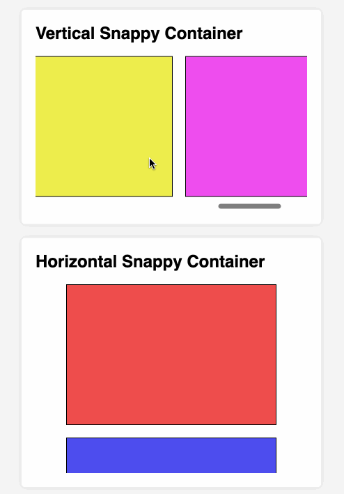

# CSS SCroll Snap

Scroll snap makes it so that the scroll position of a container is snapped according to rules defined in CSS.

In the below examples, the scroll snaps to make the most visible child (colored box) stay in the center.

